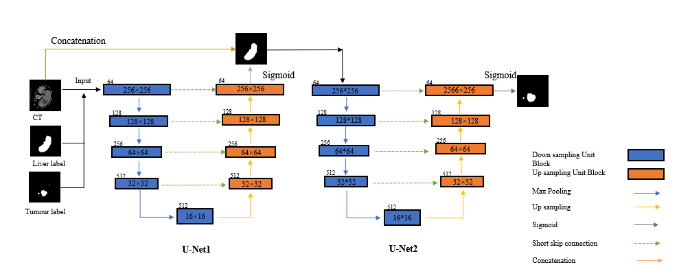
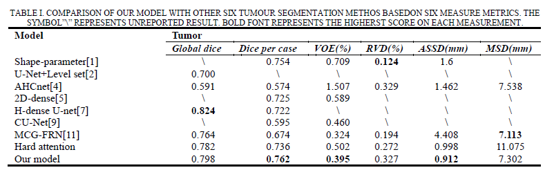

# Hybrid Attention U-Net for Liver Tumour Segmentation in CT Images

A deep learning framework for automatic liver tumour segmentation in CT images based on a hybrid attention mechanism. The proposed model combines hard attention for liver localisation and soft attention for feature refinement, enabling more accurate segmentation of tumours with varying sizes, shapes, and boundaries.

---

## Overview

Accurate liver tumour segmentation plays an important role in computer-aided diagnosis and treatment planning. However, tumour appearance varies considerably due to differences in size, contrast, shape, and surrounding tissues.

This project presents a **Hybrid Attention U-Net**, which integrates:

- Hard Attention for liver region localisation
- Soft Attention for adaptive feature refinement
- End-to-end tumour segmentation
- Encoder–decoder architecture with skip connections

Compared with conventional U-Net-based approaches, the proposed framework improves segmentation accuracy while maintaining an efficient inference pipeline.

---

## Highlights

- Hybrid attention mechanism
- Hard attention for liver localisation
- Soft attention for feature refinement
- Encoder–decoder architecture with skip connections
- Automatic liver tumour segmentation from CT images
- End-to-end deep learning framework

---

## Network Architecture

<p align="center">
  
</p>

<p align="center">
<i>Figure 1. Architecture of the proposed Hybrid Attention U-Net.</i>
</p>

The proposed network incorporates hard attention to identify the liver region before applying soft attention modules for adaptive feature enhancement throughout the encoder–decoder network.

---

## Overall Workflow

<p align="center">
  
</p>

<p align="center">
<i>Figure 2. Overall workflow of the proposed framework.</i>
</p>

The segmentation pipeline consists of:

1. CT image preprocessing
2. Liver localisation
3. Hard attention-based ROI extraction
4. Hybrid Attention U-Net segmentation
5. Final tumour prediction

---

## Experimental Results

<p align="center">
  
</p>

<p align="center">
<i>Figure 3. Representative liver tumour segmentation results.</i>
</p>

Experimental evaluation demonstrates that the proposed method achieves robust tumour segmentation across challenging CT cases, including tumours with irregular shapes, low contrast, and heterogeneous appearance.

---

## Repository Structure

```
Hybrid-Attention-UNet/
│
├── README.md
├── requirements.txt
├── train.py
├── predict.py
│
├── models/
│   └── hybrid_attention_unet.py
│
├── dataset/
│   └── data_loader.py
│
├── utils/
│   └── metrics.py
│
├── figures/
│
└── checkpoints/
```

---

## Installation

Clone the repository

```bash
git clone https://github.com/YOUR_USERNAME/Hybrid-Attention-UNet.git
cd Hybrid-Attention-UNet
```

Install dependencies

```bash
pip install -r requirements.txt
```

---

## Dataset

The experiments were conducted using the LiTS (Liver Tumor Segmentation Challenge) dataset.

Due to dataset licensing restrictions, the original CT images are **not included** in this repository.

Please organise your dataset as follows:

```
data/
└── train/
    ├── images/
    └── masks/
```

---

## Training

```bash
python train.py
```

---

## Inference

```bash
python predict.py
```

---

## Citation

If you find this work useful, please cite:

```
@article{YOUR_PAPER,
  title={Hybrid Attention U-Net for Liver Tumour Segmentation in CT Images},
  author={Your Name},
  journal={...},
  year={...}
}
```

---

## License

This repository is released for research and academic use.

---

## Acknowledgements

- University of Strathclyde
- LiTS Challenge
- TensorFlow / Keras
