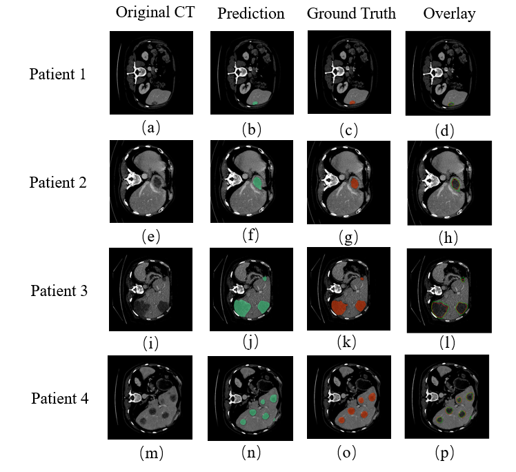

# Hybrid Attention U-Net for Liver Tumour Segmentation in CT Images

A deep learning framework for automatic liver tumour segmentation in CT images based on a hybrid attention mechanism. The proposed model combines hard attention for liver localisation and soft attention for feature refinement, enabling more accurate segmentation of tumours with varying sizes, shapes, and boundaries.

---

## Overview

Accurate liver tumour segmentation plays an important role in computer-aided diagnosis and treatment planning. However, tumour appearance varies considerably due to differences in size, contrast, shape, and surrounding tissues.

This project presents a **Hybrid Attention U-Net**, which integrates:

- Hard Attention for liver region localisation
- Soft Attention for adaptive feature refinement
- End-to-end tumour segmentation
- Encoder–decoder architecture with skip connections

Compared with conventional U-Net-based approaches, the proposed framework improves segmentation accuracy while maintaining an efficient inference pipeline.

---

## Highlights

- Hybrid attention mechanism
- Hard attention for liver localisation
- Soft attention for feature refinement
- Encoder–decoder architecture with skip connections
- Automatic liver tumour segmentation from CT images
- End-to-end deep learning framework

---

## Network Architecture

  

<i>Figure 1. Architecture of the proposed Hybrid Attention U-Net.</i>

The proposed network incorporates hard attention to identify the liver region before applying soft attention modules for adaptive feature enhancement throughout the encoder–decoder network.

---

## Experimental Results

  

<i>Figure 2. Representative liver tumour segmentation results.</i>

Experimental evaluation demonstrates that the proposed method achieves robust tumour segmentation across challenging CT cases, including tumours with irregular shapes, low contrast, and heterogeneous appearance.

---

## Visualization

  

<i>Figure 3. Visualisation of feature responses generated by the proposed Hybrid Attention U-Net.</i>

The proposed hybrid attention mechanism progressively enhances tumour-related features while suppressing irrelevant background responses. Feature visualisations demonstrate that the network focuses on discriminative tumour regions at different stages of the encoder–decoder architecture, improving boundary delineation and localisation accuracy.

---

